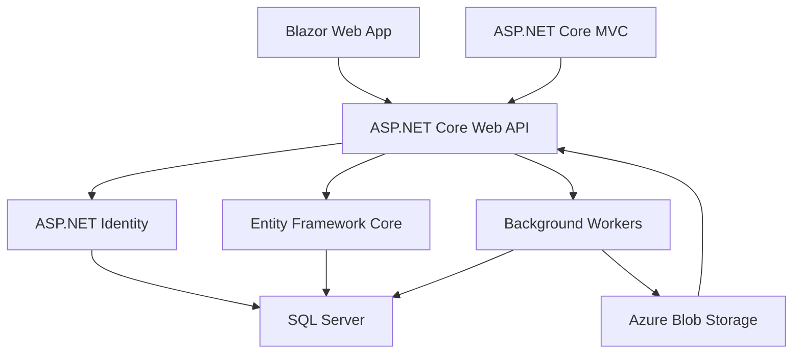
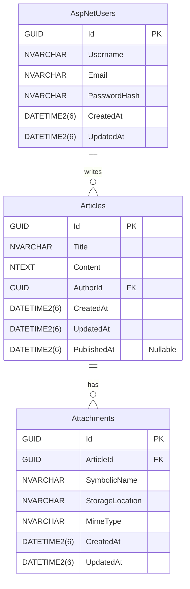

# Technical Specification

## Aim of the Project

ProPulse aims to provide an AI-enhanced content publishing platform that streamlines the entire content lifecycle, from creation to marketing. The MVP phase focuses on delivering a robust foundation for content creation, management, and publishing, targeting enterprise marketing teams and independent content creators.

## Systems Overview

The MVP will consist of the following components:

1. **Frontend**:
   - A Blazor Web App for the admin portal and authoring experience.
   - ASP.NET Core MVC for public-facing content display.
   - Responsive design to support both mobile and desktop devices.

2. **Backend Services**:
   - ASP.NET Core Web API with a vertical slice architecture.
   - ASP.NET Identity for authentication and authorization.
   - Entity Framework Core for data persistence.
   - Background workers for scheduled publishing.

3. **Data Storage**:
   - SQL Server for relational data (users, articles, scheduling).
   - Azure Blob Storage for media files and images.

4. **Infrastructure**:
   - .NET Aspire for local development orchestration.
   - Azure Container Apps for production hosting.
   - CI/CD pipelines via GitHub Actions.

### Systems Overview Diagram

## Technical Decisions

### Markdown Editor
- **Decision**: Use Markdig for the visual markdown editor.
- **Alternatives Considered**: Building a custom editor vs. integrating an open-source library.
- **Recommendation**: Markdig is a well-respected CommonMark parser that is efficient and feature-rich, making it ideal for creating and converting markdown files.

### Authentication
- **Decision**: Use ASP.NET Identity for user authentication.
- **Alternatives Considered**: Custom authentication vs. ASP.NET Identity.
- **Recommendation**: ASP.NET Identity provides a secure and extensible solution with minimal setup.

### Data Storage
- **Decision**: Use SQL Server for relational data and Azure Blob Storage for media.
- **Alternatives Considered**: NoSQL databases vs. SQL Server.
- **Recommendation**: SQL Server aligns with the modular monolith architecture and supports complex queries.

### Logging and Telemetry
- **Decision**: Use Serilog for logging and telemetry
- **Alternatives Considered**: NLog, ASP.NET COre native logging
- **Recommendation**: Serilog is well regarded and supported with specific sinks for Azure services.

## Data Model

### Tables

#### AspNetUsers (ASP.NET Identity Default)
- **Note**: This table, along with other ASP.NET Identity tables, will be implemented as per ASP.NET Identity's default schema and requirements.

#### Articles
| Column Name     | SQL Type       | .NET Type        | Options              | Usage                     |
|-----------------|----------------|------------------|----------------------|---------------------------|
| Id              | GUID           | Guid             | Primary Key, Indexed | Unique identifier         |
| Title           | NVARCHAR(200)  | string           | Indexed              | Title of the article      |
| Content         | NTEXT          | string           |                      | Content of the article    |
| AuthorId        | GUID           | Guid             | Foreign Key, Indexed | Links to AspNetUsers      |
| CreatedAt       | DATETIME2(6)   | DateTimeOffset   | Indexed              | Creation timestamp        |
| UpdatedAt       | DATETIME2(6)   | DateTimeOffset   | Indexed              | Last update timestamp     |
| PublishedAt     | DATETIME2(6)   | DateTimeOffset?  | Nullable, Indexed    | Publication timestamp     |
| PublishedUntil  | DATETIME2(6)   | DateTimeOffset?  | Nullable, Indexed    | Expiry date of the article|
| Version         | ROWVERSION     | byte[]           | Indexed              | Row version for concurrency|

#### Attachments
| Column Name     | SQL Type       | .NET Type        | Options              | Usage                     |
|-----------------|----------------|------------------|----------------------|---------------------------|
| Id              | GUID           | Guid             | Primary Key, Indexed | Unique identifier         |
| ArticleId       | GUID           | Guid             | Foreign Key, Indexed | Links to Articles         |
| SymbolicName    | NVARCHAR(200)  | string           | Indexed              | User-friendly name        |
| StorageLocation | NVARCHAR(MAX)  | string           |                      | Path to the attachment    |
| MimeType        | NVARCHAR(100)  | string           |                      | MIME type of the file     |
| CreatedAt       | DATETIME2(6)   | DateTimeOffset   | Indexed              | Creation timestamp        |
| UpdatedAt       | DATETIME2(6)   | DateTimeOffset   | Indexed              | Last update timestamp     |
| Version         | ROWVERSION     | byte[]           | Indexed              | Row version for concurrency|

### Notes on Indices and Triggers
- **Indices**: Indices will be added to almost all fields to optimize query performance.
- **Triggers**: Database triggers will be used to automatically maintain the `CreatedAt` and `UpdatedAt` columns for all tables.

### Mermaid ER Diagram

## API Models

### Endpoints

#### General API Design
- **Versioning**: Endpoints will be versioned using a date format. The version can be specified either via a header (`ApiVersion: 2025-04-15`) or a query parameter (`?api-version=2025-04-15`). If no version is specified, the latest version will be assumed.
- **OData Semantics**: List operations will support OData query parameters such as `$filter`, `$search`, `$orderby`, `$top`, and `$skip` to enable flexible querying.
- **Optimistic Concurrency**: `PUT` and `DELETE` operations will use RFC9110 conditional access headers (e.g., `If-Match`, `If-Unmodified-Since`) to ensure optimistic concurrency control.

#### Authentication
- `POST /api/auth/register`: Register a new user.
- `POST /api/auth/login`: Authenticate a user.

#### Articles
- `GET /api/articles`: List all articles (supports OData semantics).
- `POST /api/articles`: Create a new article.
- `GET /api/articles/{id}`: Retrieve a specific article.
- `PUT /api/articles/{id}`: Update an article (requires RFC9110 conditional headers).
- `DELETE /api/articles/{id}`: Delete an article (requires RFC9110 conditional headers).

#### Attachments
- `POST /api/articles/{id}/attachments`: Upload an attachment.
- `GET /api/articles/{id}/attachments`: List attachments for an article (supports OData semantics).
- `GET /api/articles/{id}/attachments/{attachmentId}`: Retrieve a specific attachment by ID.
- `PUT /api/articles/{id}/attachments/{attachmentId}`: Update an attachment (requires RFC9110 conditional headers).
- `DELETE /api/articles/{id}/attachments/{attachmentId}`: Delete an attachment (requires RFC9110 conditional headers).

## UI Design

### Flows

1. **Authoring**:
   - Create, edit, and preview articles using a visual markdown editor.
   - Upload and manage attachments.

2. **Publishing**:
   - Publish articles immediately or schedule for later.
   - Set expiration dates for time-sensitive content.

3. **Reading**:
   - Browse articles on the homepage.
   - View articles with proper formatting and embedded media.

## Testing Design

- Unit tests for all API endpoints.
- Integration tests for database interactions.
- UI tests for the Blazor Web App.
- Load testing for scheduled publishing.

### Testing Framework

* xUnit test runner
* xUnit assertions
* NSubstitute for mocking
* TestContainers for database testing
* WebApplicationFactory for service testing
* Coverlet / Corbetura for code coverage
* Playwright for UI testing

All integration and unit tests should be runnable using dotnet test.  We prefer to test end-to-end
(using the service and testcontainers), and drop
out of that for edge cases that are not easily 
testable. 

The UI will be tested end-to-end with Playwright.  Ideally, these would also be run with dotnet test.

Aim for 75% coverage for the application (not including test classes and Aspire hosting classes)

## Security and Privacy Considerations

- Use HTTPS for all communications.
- Encrypt sensitive data such as passwords using ASP.NET Identity.
- Implement role-based access control for admin and author functionalities.
- Regularly audit logs for suspicious activities.

## Project Layout

The project will follow a modular monolith structure with the following top-level directories and projects:

- **/project**: Contains project-related documentation such as product proposals, technical specifications, and implementation plans.
- **/docs**: Contains project documentation, including architecture, API references, and user guides.
- **/aspire**: Contains the source code to set up the .NET Aspire orchestration.
  - **ProPulse.AppHost** provides the application host.
  - **ProPulse.ServiceDefaults** provides the common service defaults.
- **/src**: Contains the source code for the deployable application, organized by vertical slices.
  - **ProPulse.Web**: The main web application project, including the Blazor Web App and ASP.NET Core MVC components.
  - **ProPulse.Application**: Contains application logic, including interfaces, behaviors, and service implementations.
  - **ProPulse.DataModel**: Contains domain entities, value objects, and domain events.
  - **ProPulse.DataModel.Migrations**: Database migration facility and scripts using DbUp.
  - **ProPulse.Initializer**: Command line tool that applies migrations to a given database provided as a connection string.
- **/test**: Contains unit, UI, and integration test code for the application.
  - **ProPulse.Web.Tests**: Tests for the web application.
  - **ProPulse.Application.Tests**: Tests for application logic.
  - **ProPulse.DataModel.Tests**: Tests for domain entities and logic.
  - **ProPulse.DataModel.Migration.Tests**: Tests for database migrations.
  - **ProPulse.Initializer.Tests**: Tests for the database initializer.
  - **ProPulseTests.Common**: Common code for tests (such as setting up the test containers, test data seeding, and setting up the service for testing)
